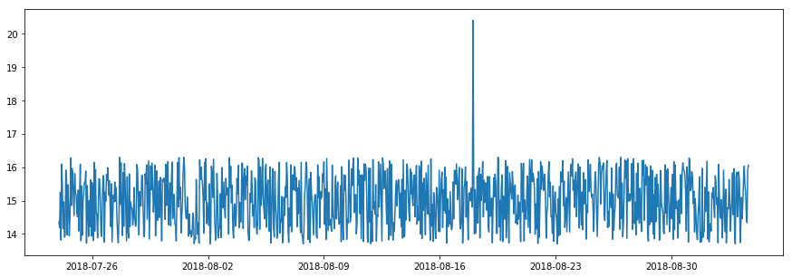
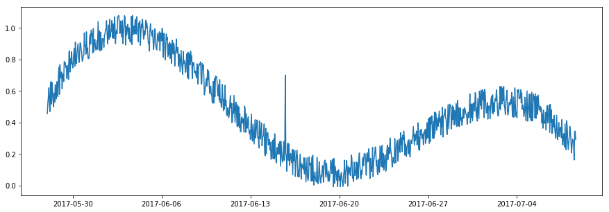
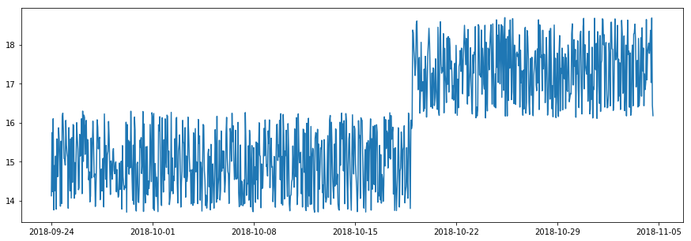
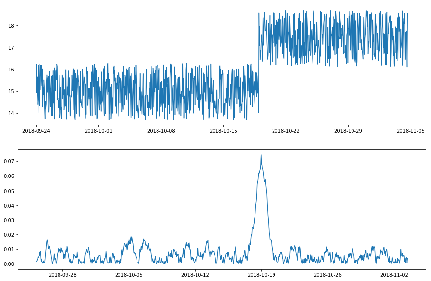
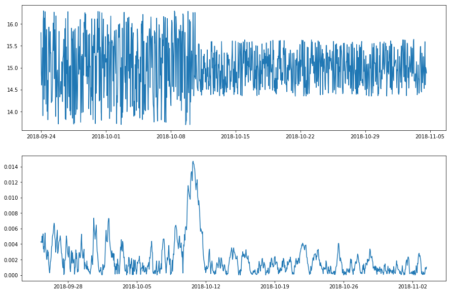
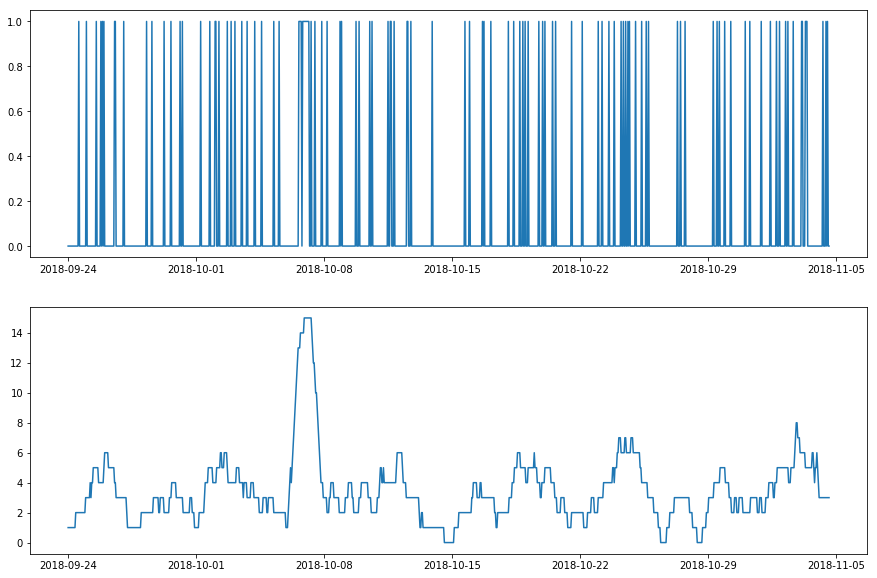
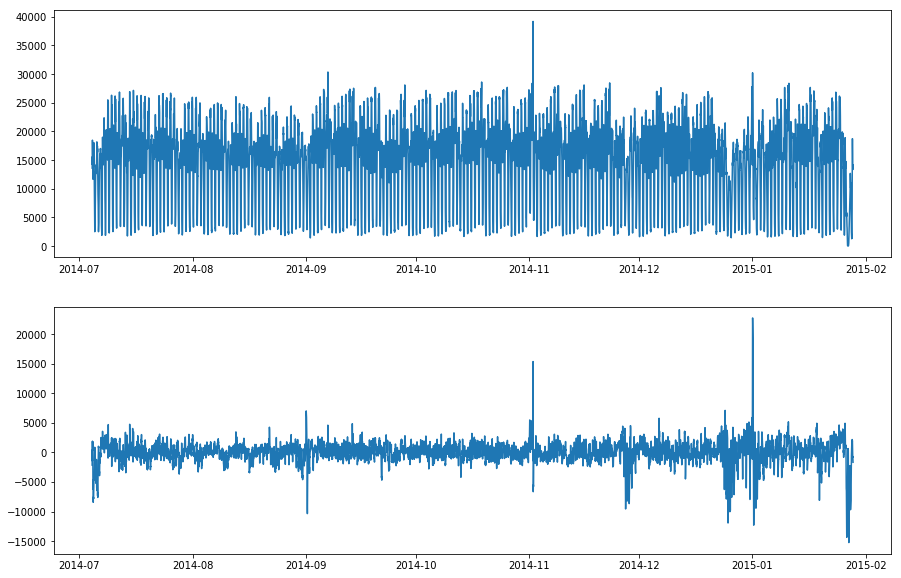
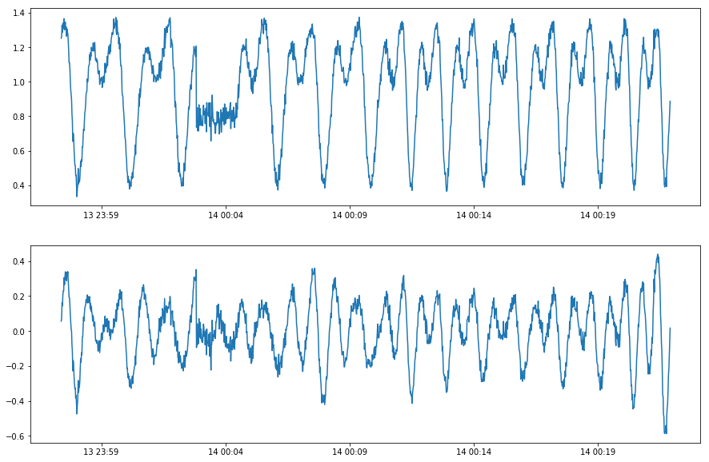

.. _userguide:

**********
User Guide
**********

This is a brief guide of how to build an anomaly detection model for time series with ADTK. We recommend all users to read through this guide before starting to use ADTK.


- `Unsupervised vs. Supervised`_
- `Anomaly Types`_
- `Univariate vs. Multivariate`_
- `Detector, Transformer, Aggregator, and Pipe`_

----------

Unsupervised vs. Supervised
===================================

The first thing a user needs to decide before building a model is whether to formulate the problem as a supervised learning problem or an unsupervised problem. Supervised learning methods train models based on time series and normal/anomalous labels in the training set, while unsupervised methods build models only based on time series and domain knowledge, and do not require data labeled.

Real-world anomaly detection problems usually suffer from lack of labeled historical anomalies, which may prevent users from building a robust supervised model. In this case, an unsupervised/rule-based method is a better choice. ADTK is a package for unsupervised/rule-based models of time series anomaly detection. If a user formulates a task as a supervised learning problem, alternative tools will be needed.

Anomaly Types
=====================

Anomaly is a broad concept, which may refer to many different types of events in time series. A spike of value, a shift of volatility, a violation of seasonal pattern, etc. could all be anomalous or normal, depending on the specific context. ADTK offers a set of common components that can be combined into various types of anomaly detection models for different scenarios. However, ADTK does not select or build a model for a user automatically. A user should know what type of anomaly to detect, therefore can build a model accordingly.

Outlier
```````

An *outlier* is a data point whose value is significantly different from others. An outlier point in a time series time exceeds the normal range of this series, without considering the temporal relationship between data points. In other words, even regarding all data points as time-independent, an outlier point still outstands.



    Outlier

To detect outliers, the *normal range* of time series values is what a detector needs to learn. It can be defined with user-given absolute thresholds (:py:mod:`adtk.detector.ThresholdAD`). Alternatively, a user may create a detector to learn the normal range from historical data (:py:mod:`adtk.detector.QuantileAD`, :py:mod:`adtk.detector.InterQuartileRangeAD`, and  :py:mod:`adtk.detector.GeneralizedESDTestAD`).


**Outlier is the most basic type of anomaly. Anomaly detection methods targeting at other types often transform a time series into a new one to which outlier detection is applied. Most advanced detectors in ADTK follow this strategy.**

Spike and Level Shift
`````````````````````

In some situations, whether a time point is normal depends on if its value is aligned with its near past. An abrupt increase or decrease of value is called a *spike* if the change is temporary, or a *level shift* if the change is permanent. Please note that, although a spike appears similar to an outlier, it is time-dependent while an outlier is time-independent. The value of a spike could be normal if examing with all data points without considering temporal order (see figure below).



    Spike



    Level shift

We may slide two time windows side-by-side and keep tracking the difference between their mean or median values. This difference over time, which is a new time series, is examed by an outlier detector. Whenever the statistics in left and right windows are significantly different, it indicates an abrupt change around this time point. The length of time window controls the time scale of changes to detect: for spikes, the left window is longer than the right one to capture representative information of the near past; on the other hand, for level shifts, both windows should be long enough to capture stable status.

:py:mod:`adtk.detector.PersistAD` and :py:mod:`adtk.detector.LevelShiftAD` are detectors of spikes and level shifts respectively. Both are implemented with transformer :py:mod:`adtk.transformer.DoubleRollingAggregate` which transforms a time series to the new series with two time windows as mentioned above.



    Transform a time series with level shift using `DoubleRollingAggregate` with mean as time window statistic.

Pattern Change
``````````````
The strategy mentioned above could be generalized to detect the shift of patterns other than value. For example, if shifts of volatility is of interest, the statistic to track in time windows can be standard deviation instead of mean/median. :py:mod:`adtk.transformer.DoubleRollingAggregate` supports 16 common statistics that could be used to quantify the pattern of interest.



    Transform a time series with volatility level shift using `DoubleRollingAggregate` with standard deviation as metric.

For detecting temporal changes of pattern, :py:mod:`adtk.transformer.RollingAggregate` could also be a good choice. It slides a time window and returns a statistic measured inside the window that quantifies a temporal pattern. For example, if a user wants to detect temporary anomalously high number of visit to a system, tracking the number of visits in sliding window is an effective approach.



    Transform a time series with temporary high frequency of requests using `RollingAggregate` with number of non-zeros values as metric.

Seasonality
```````````
A seasonal pattern exists when a time series is influenced by seasonal factors (e.g. the hour of the day, the day of the week, the month of the year). Detector :py:mod:`adtk.detector.SeasonalAD` uses transformer :py:mod:`adtk.transformer.ClassicSeasonalDecomposition` to remove the seasonal pattern from the original time series, and highlight time period when the time series does not follow the seasonal pattern normally by examing the residual series.



    Remove the seasonal pattern from time series of NYC traffic using `ClassicSeasonalDecomposition` with the period as a week (data from `Numenta Anomaly Benchmark <https://github.com/numenta/NAB>`_)

A user needs to be careful about distinguishing seasonal series and cyclic series. A seasonal series always has a fixed, usually interpretable and known, period because of its seasonal nature. A cyclic time series does not follow a fixed periodic pattern because of its physics nature, even if it appears repeating similar subseries. For example, the trajectory of a moving part in rotating equipment is a 3-D cyclic time series, whose cycle length depends on rotation speed and is not necessarily fixed. Applying seasonality decomposition to it would be problematic, because every cycle may last a slightly different length, and decomposition residuals will be misleading for anomaly detection purpose.



    Applying `ClassicSeasonalDecomposition` to a cyclic series fails to detect anomalous behavior.

Currently, ADTK does not provide a transformer that removes cyclic patterns from cyclic (but not seasonal) time series. However, :py:mod:`adtk.detector.AutoregressionAD` can capture changes of autoregressive relationship (the relationship between a data point and points in its near past) and could be used for cyclic (but not seasonal) series in some situations.


Univariate vs. Multivariate
===========================

If the time series to detect anomalies from is univariate, anomaly detection models should use univariate transformers in :py:mod:`adtk.transformer` and univariate detectors in :py:mod:`adtk.detector`.

If the time series is multivariate, a user should understand whether the anomaly detection task is *separable* over series or not. In many cases, detecting anomalies along each series in parallel satisfies the need. For example, if a user has a two-dimensional time series, temperature and humidity, and is trying to detect anomalous temperature or humidity, then applying univariate detector to both temperature and humidity respectively and then aggregating the results will satisfy the need. For users' convenience, when a univariate detector or univariate transformer is applied to a multivariate series (i.e. pandas DataFrame), it applies to every series automatically.

Sometimes, a user needs to use intrinsic multivariate algorithms, if the type of anomalies to detect cannot be represented by single dimensions separately. For the previous example, if the user tries to detect anomalous `heat index <https://www.weather.gov/safety/heat-index>`_ (a hybrid metric of temperature and humidity), multivariate transformers and detectors should be considered, because anomalies must be detected based on temperature and humidity simultaneously.

Detector, Transformer, Aggregator, and Pipe
===========================================

ADTK provides three types of components to be combined into a model.
A detector is a component that scans time series and returns anomalous time points. They are all included in module :py:mod:`adtk.detector`.
A transformer is a component that transforms time series such that useful information is extracted. It can also be interpreted as a feature engineering component. They are all included in module :py:mod:`adtk.transformer`.
An Aggregator is a component that combines different detection results (anomaly lists). It is an ensemble component. They are all included in module :py:mod:`adtk.aggregator`.

A model can be a single detector or a combination of multiple components. If the combination is sequential, i.e. one or several transformers connected with a detector sequentially, it can be connected by an :py:mod:`adtk.pipe.Pipeline` object. If the combination is more complicated and not sequential, it can be connected by an :py:mod:`adtk.pipe.Pipenet` object.
Many detectors in :py:mod:`adtk.detector` are internally implemented as a Pipeline or Pipenet object, but are listed in module :py:mod:`adtk.detector` for users' convenience.

For any component that has yet been implemented, a user may implement it as a function and use components :py:mod:`adtk.detector.CustomizedDetector1D`, :py:mod:`adtk.detector.CustomizedDetectorHD`, :py:mod:`adtk.transformer.CustomizedTransformer1D`, :py:mod:`adtk.transformer.CustomizedTransformerHD`, or :py:mod:`adtk.aggregator.CustomizedAggregator` to convert a function into an ADTK component. Then it has the unified APIs and can be used as a normal ADTK component (for example, to be connected with other components using Pipeline or Pipenet). Users are always welcomed to contribute their algorithm into the package permanently. More information for contributors can be found in :ref:`developer`.

A user may check :ref:`examples` for examples of ADTK components.
